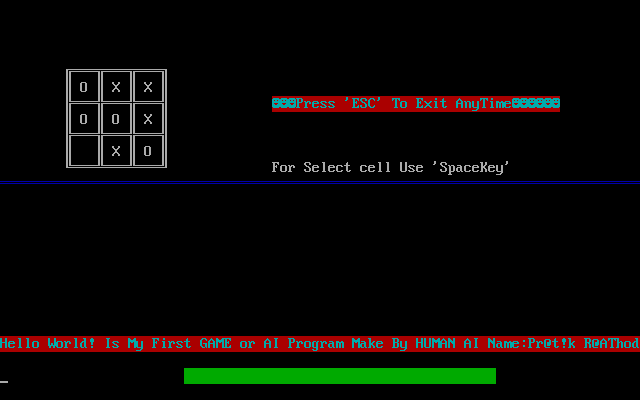

# Tictactoe 
A AI Game Using C  
Hello world ! I am Pratik Rathod  
 #This game was developed in time of diploma 2nd SEM(In time i just started lerning languages..(; )  
 #This game devloped in c without third party engine AI engine 
 #You can move cursor using Arrow Keys. 
 #And also Great UI in C without Using graphics lib. 
 #I devloped using Turboc.. 
  Here are some Screenshots of TicTacToe Game 
  <h2>1.</h2>
  
 <h2>2.</h2>
 
 
